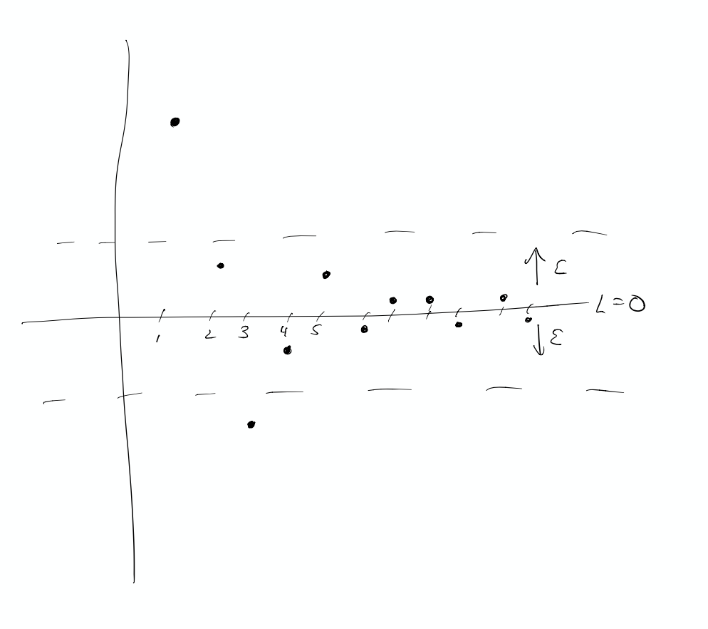

% Math 2710
% Oct 21-25

## Sequences

**Definition:** An (infinite) sequence with rational coefficients is a function $a:\mathbb{P}\to\mathbb{Q}$.  Normally we view
it as the sequence $a(1),a(2),\ldots$.

Some examples:

- $a(n)=0$ for all $n$ (the zero sequence).
- $a(n)=1/n$ for $n=1,2,\ldots$
- $a(n)=n$ for $n=1,2,\ldots$
- $a(n)=(-1)^n$ for $n=1,2,\ldots$

We would like to have a way to speak about what happens to sequences as $n$ gets larger and larger (so for example the sequence
grows, it bounces around, or it approaches a particular number.)

## Limit of a sequence

**Definition:** Let $a(n)$ be a sequence.  Then we say that the limit of $a(n)$ is $L$ if, for every $\epsilon>0$, there is an integer
$N$, so that $|a(n)-L|<\epsilon$ for all $n\ge N$.   This is written:

$$
\lim_{n\to\infty} a(n)=L.
$$

and we say that the sequence *converges to $L$*.

## Limits are about estimation

**Examples** 

- Let $a(n)$ be the sequence defined by $a(1)=1, a(2)=1/2, and a(n)=0$ for $n>2$.  Prove that the limit $\lim_{n\to\infty} a(n)=0$.
- Let $a(n)$ be the sequence $a(n)=1/n$.  Prove that the limit of $a(n)$ as $n\to\infty$ is zero.
- Let $a(n)=(-1)^{n}$.  Prove that the limit isn't $1$.  Then prove there is no limit.
- Let $a(n)=n$.  Is there a limit?
- Let $a(n)=(n+1)/n$.  Prove that the limit is $1$.
- Let $a(n)=4+(-1/2)^{n}$.  

## Some other limit properties

**Proposition:**
Let $a(n)$ be a sequence and let $b(n)$ be the sequence defined by $b(n)=a(n+5)$.  (so $b(n)$ is the same as $a(n)$ but it "starts later.")
Prove that $a(n)$ converges if and only if $b(n)$ converges.
